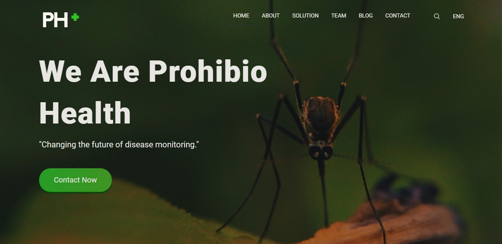

# Prohibio Health Website
While working at the [DMZ Sandbox Accelerator](https://dmz.ryerson.ca/dmz-sandbox/), my team created an [AI algorithm](https://github.com/Madhav-Malhotra/Prohibio-Health-Algorithm) to predict insect migration based on climate data. The goal was to use insect migration patterns to predict disease outbreaks transmitted by insects. 

Visit [the website](https://paige-gugeler.github.io/Prohibio-Health-Website/) to learn more about our project! 

-----------------------

